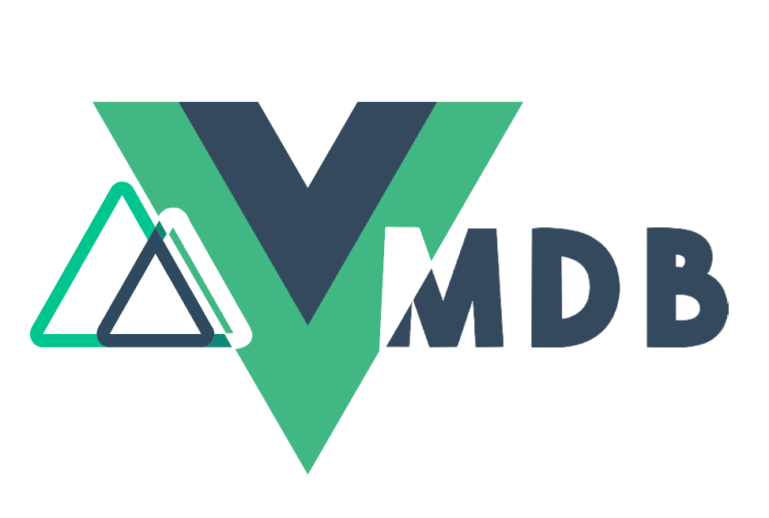

# MDB Vue + Nuxt.js

<div align="center">
<br>

<br>
<br>
</div>


- Nuxt.js **2.0.0**
- MDB Vue **6.5.1**

## Build Setup

```bash
# install dependencies
$ npm install

# serve with hot reload at localhost:3000
$ npm run dev

# build for production and launch server
$ npm run build
$ npm run start

# generate static project
$ npm run generate
```

## Learn more about Nuxt.js:

For detailed explanation on how things work, check out [Nuxt.js docs](https://nuxtjs.org).
